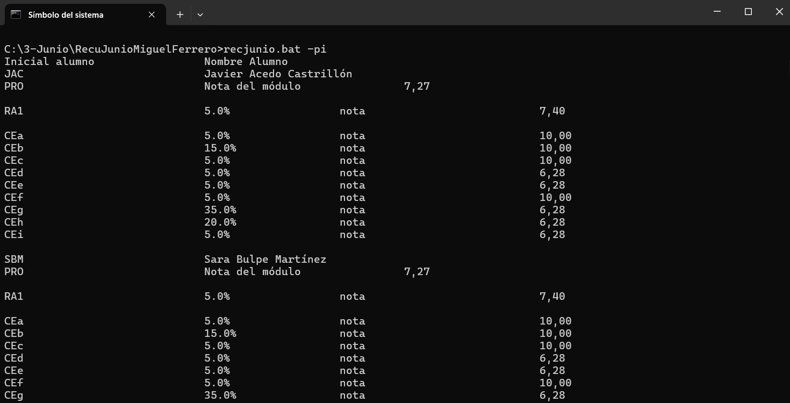

# Comandos

## -pi 

### Comando que muestra la lista de los alumnos, pilla la carpeta inicializada por defecto, en este caso csvfiles

## -pi csvfiles

### Comando que muestra la lista de los alumnos, pilla la carpeta seleccionada, en este caso csvfiles

## -pi csvfiles -mo

### Comando que muestra la lista de los alumnos del modulo seleccionado de la carpeta, en este caso pilla el modulo inicializado por defecto PRO

## -pi csvfiles -mo BBDD

### Comando que muestra la lista de los alumnos del modulo seleccionado de la carpeta, en este caso BBDD

